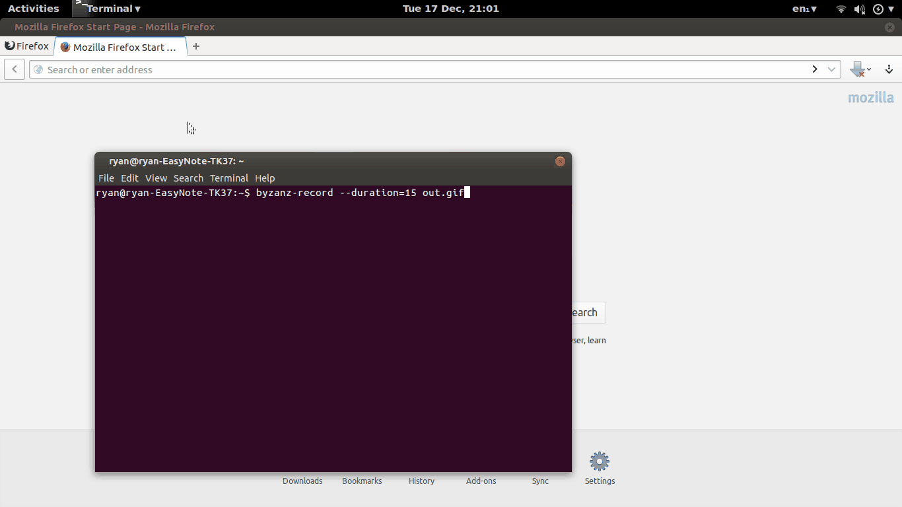

Bang! v0.2.0
===========

Bang! (a nod to Bing) is a metasearch engine. It uses shorthands
like "!w Alpaca" or "! how to buy an Alpaca" to search other search engines
and websites and brings you straight to your results.

**Bang!** is inspired by DuckDuckGo's '!' syntax, but with some key differences. **Bang!**
is locally hosted so your data is not shared with DuckDuckGo during redirection.
**Bang!** also can redirect to locally hosted webapps running on specific ports using
"@ 8910" syntax.

It is currently only supported for Firefox, since that's my browser of choice.

 </img>

### 1 Requirements

* Firefox (tested on 26)
* Ubuntu, or possibly another UNIX distro. (tested on Ubuntu 13.10)
* Node.js v0.10.20
* Node forever

### 2 Installation

First, download the repository from github.

```bash
git clone https://github.com/rgrannell1/bang
cd bang
```

The firefox plugin can be installed by running the following
from the firebug terminal (F12) at the firefox start screen. This
step may be problematic - it didn't seem to work consistently on my Ubuntu Firefox 26.

```
window.external.addSearchProvider("https://raw2.github.com/rgrannell1/bang/master/bang.xml");
```

The node server can then be executed manually (it defaults to running on port
8125).

```bash
sudo add-apt-repository ppa:chris-lea/node.js
sudo apt-get update
sudo apt-get install nodejs
```

```bash
node lib/bang.js
```

For long-term use it is wise to set the node server to start automatically
after restart using crontab Node forever is required to restart the script
in the event of a crash, so install it.

```bash
sudo npm install forever -g
```
Now edit the crontab and add the following line to the end

```bash
crontab -e
@reboot /home/user/absolute_path_to_bang_cronjob.py
```

Switching that path for the path to the shell script included in this
repository.

After all you need to reboot to start the cron job,
and then you should be ready to go!

### 3 License

The MIT License

Copyright (c) 2013 Ryan Grannell

Permission is hereby granted, free of charge, to any person obtaining a copy of this software and associated documentation files (the "Software"), to deal in the Software without restriction, including without limitation the rights to use, copy, modify, merge, publish, distribute, sublicense, and/or sell copies of the Software, and to permit persons to whom the Software is furnished to do so, subject to the following conditions:

The above copyright notice and this permission notice shall be included in all copies or substantial portions of the Software.

THE SOFTWARE IS PROVIDED "AS IS", WITHOUT WARRANTY OF ANY KIND, EXPRESS OR IMPLIED, INCLUDING BUT NOT LIMITED TO THE WARRANTIES OF MERCHANTABILITY, FITNESS FOR A PARTICULAR PURPOSE AND NONINFRINGEMENT. IN NO EVENT SHALL THE AUTHORS OR COPYRIGHT HOLDERS BE LIABLE FOR ANY CLAIM, DAMAGES OR OTHER LIABILITY, WHETHER IN AN ACTION OF CONTRACT, TORT OR OTHERWISE, ARISING FROM, OUT OF OR IN CONNECTION WITH THE SOFTWARE OR THE USE OR OTHER DEALINGS IN THE SOFTWARE.
